# Building a Kubernetes Cluster from Scratch on AWS

This project demonstrates how I built and verified a two-node Kubernetes cluster on AWS using Amazon EC2, `containerd`, `kubeadm`, `kubelet`, `kubectl`, and Calico.

The project also includes an Nginx application deployed with a Kubernetes Deployment, exposed through a Service, configured with a ConfigMap, and supplied with demonstration-sensitive data through a Secret.

## Project Objective

The objective was to understand Kubernetes from the infrastructure level before moving to managed services such as Amazon EKS.

This project helped me understand:

- Control plane and worker node responsibilities
- Container runtime and node-agent communication
- Cluster initialization with `kubeadm`
- Pod networking with Calico
- Deployments, Pods, labels, and selectors
- Services and stable application networking
- ConfigMaps and Secrets
- Application verification with `kubectl` and `curl`

## Architecture Overview

```text
AWS
│
├── EC2 Control Plane
│   ├── kube-apiserver
│   ├── etcd
│   ├── scheduler
│   ├── controller-manager
│   ├── kubelet
│   └── kubectl
│
└── EC2 Worker Node
    ├── kubelet
    ├── containerd
    └── Nginx Pods
         ├── Pod 1
         └── Pod 2

Calico provides Pod networking between the nodes.
```

## Technologies Used

- AWS EC2
- Ubuntu Linux
- AWS CLI
- Kubernetes
- `kubeadm`
- `kubelet`
- `kubectl`
- `containerd`
- Calico
- Nginx
- Git and GitHub

## Project Structure

```text
aws-kubernetes-from-scratch/
├── kubernetes/
│   ├── deployment.yaml
│   ├── service.yaml
│   ├── configmap.yaml
│   └── secret.yaml
├── screenshots/
├── docs/
└── README.md
```

## Kubernetes Components

### Deployment

The Deployment manages the Nginx Pods and maintains two replicas.

If a Pod fails, Kubernetes creates a replacement Pod to restore the desired state.

### Service

The Service provides a stable network endpoint for the Pods.

It uses the label selector `app: nginx` to discover and route traffic to the correct Pods.

### ConfigMap

The ConfigMap stores non-sensitive application configuration:

```text
APP_NAME
ENVIRONMENT
LOG_LEVEL
```

### Secret

The Secret stores demonstration-sensitive data:

```text
DB_PASSWORD
```

The password in this project is dummy data and must not be used in production.

## Cluster Setup

The Kubernetes cluster was built in an AWS lab environment using two Amazon EC2 instances: one configured as the control-plane node and the other as the worker node.

### Verify local tools

Before connecting to AWS, I verified that the required tools were installed.

```powershell
git --version
terraform version
aws --version
```

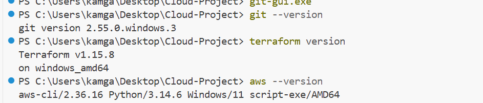

---

### Verify AWS connectivity

I confirmed that the AWS CLI was authenticated and identified the running EC2 instances that would be used for the Kubernetes cluster.

```powershell
aws ec2 describe-instances `
  --region us-east-1 `
  --filters "Name=instance-state-name,Values=running" `
  --query "Reservations[].Instances[].InstanceId" `
  --output table
```

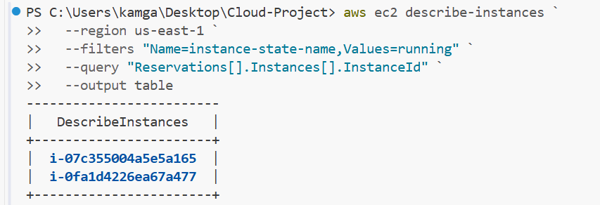

---

### Prepare the control-plane node

IPv4 forwarding was enabled before initializing the Kubernetes cluster.

```bash
sudo sysctl -w net.ipv4.ip_forward=1
sudo sed -i '/^#net\.ipv4\.ip_forward=1/s/^#//' /etc/sysctl.conf
sudo sysctl -p
```

---

### Initialize the control plane

The Kubernetes control plane was initialized using `kubeadm`.

```bash
sudo kubeadm init \
  --pod-network-cidr=192.168.0.0/16 \
  --cri-socket=unix:///run/containerd/containerd.sock
```

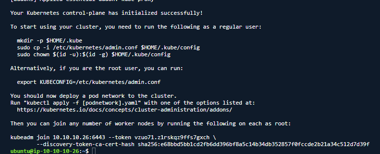

The initialization completed successfully and generated:

- Commands to configure `kubectl`
- The `kubeadm join` command required by the worker node

---

### Configure kubectl

The kubeconfig file was copied to the Ubuntu user's home directory to allow cluster administration.

```bash
mkdir -p $HOME/.kube

sudo cp -i /etc/kubernetes/admin.conf $HOME/.kube/config

sudo chown $(id -u):$(id -g) $HOME/.kube/config
```

---

### Verify the control-plane node

The control-plane node was verified before adding the worker node.

```bash
kubectl get nodes
```

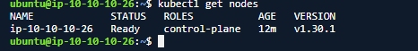

---

### Install Calico networking

Calico was installed as the Kubernetes Container Network Interface (CNI) plugin.

```bash
kubectl create -f https://raw.githubusercontent.com/projectcalico/calico/v3.28.0/manifests/tigera-operator.yaml
```

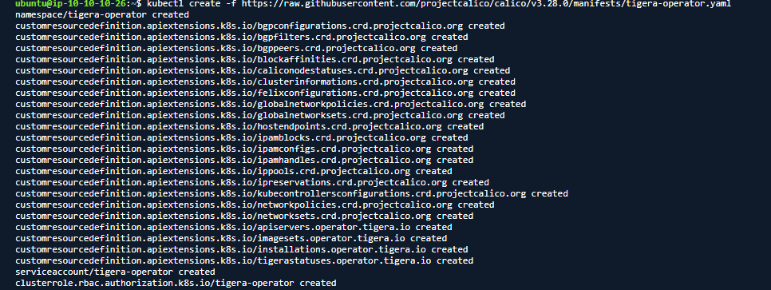

---

### Join the worker node

A worker join command was generated from the control plane.

```bash
kubeadm token create --print-join-command
```

The generated command was executed on the worker node.

```bash
sudo kubeadm join <control-plane-private-ip>:6443 \
  --token <token> \
  --discovery-token-ca-cert-hash sha256:<hash>
```

Temporary tokens and certificate hashes have been omitted from this repository.

---

### Verify the cluster

After the worker node joined successfully, the cluster was verified.

```bash
kubectl get nodes
```

Both the control-plane node and worker node reached the **Ready** state before deploying the application.

## Deploy the Kubernetes Resources

The ConfigMap and Secret were created before the Deployment because the Deployment references them.

```bash
kubectl apply -f configmap.yaml
kubectl apply -f secret.yaml
kubectl apply -f deployment.yaml
kubectl apply -f service.yaml
```

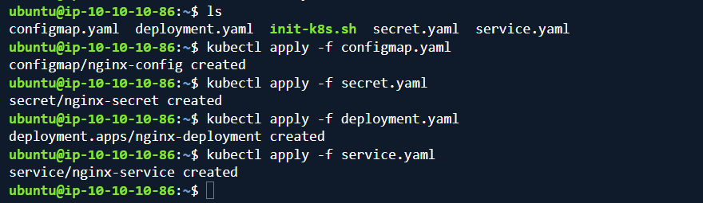

## Verify the Deployment

```bash
kubectl get deployments
kubectl get pods
kubectl get svc
kubectl get configmaps
kubectl get secrets
```

The Deployment successfully created two available Nginx Pods.

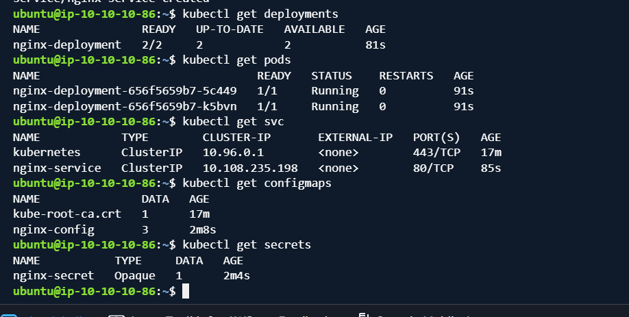

## Verify Service Endpoints

```bash
kubectl get endpoints nginx-service
```

The Service discovered both Nginx Pods through the matching label selector.

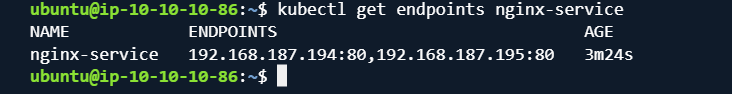

## Verify Pod Scheduling

```bash
kubectl get pods -o wide
```

Both Nginx Pods were scheduled on the worker node.

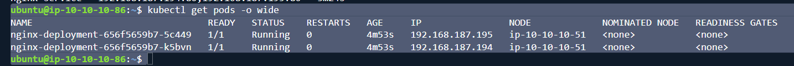

## Verify ConfigMap and Secret Injection

```bash
kubectl exec <pod-name> -- env | \
grep -E "APP_NAME|ENVIRONMENT|LOG_LEVEL|DB_PASSWORD"
```

The container received environment variables from both the ConfigMap and Secret.

```text
DB_PASSWORD=********
APP_NAME=My Kubernetes App
ENVIRONMENT=Development
LOG_LEVEL=INFO
```

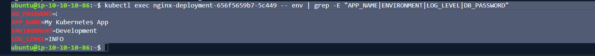

## Test the Application with NodePort

The Service was temporarily changed to `NodePort` for end-to-end testing:

```yaml
spec:
  type: NodePort
  selector:
    app: nginx
  ports:
    - protocol: TCP
      port: 80
      targetPort: 80
      nodePort: 30080
```

After applying the change:

```bash
kubectl apply -f service.yaml
kubectl get svc
```

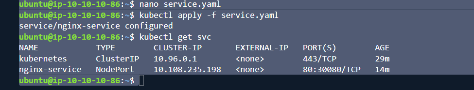

The application was tested from the control-plane node:

```bash
curl http://<worker-private-ip>:30080
```

The Nginx welcome HTML confirmed the full traffic path:

```text
Control-plane request
        ↓
Worker node:30080
        ↓
NodePort Service
        ↓
Nginx Pod port 80
        ↓
Nginx application
```

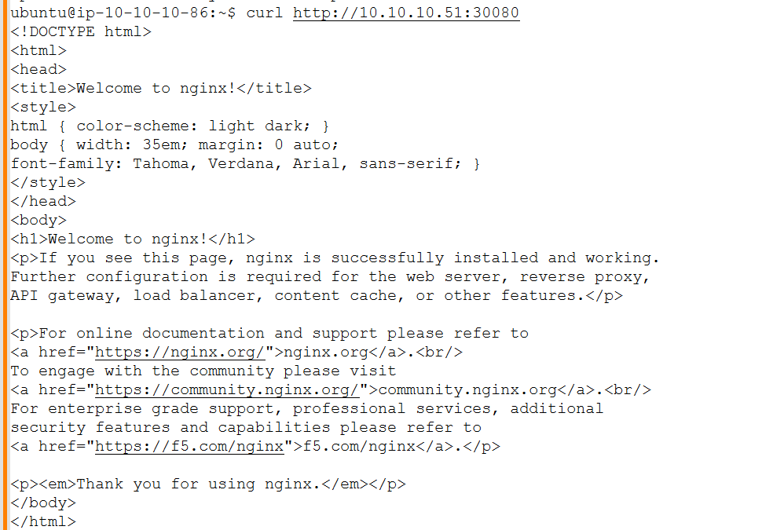

## What I Learned

- How to bootstrap a Kubernetes cluster using `kubeadm`
- The difference between the control plane and worker node
- How `kubelet` and `containerd` run Pods on worker nodes
- How a Deployment maintains the desired number of replicas
- How labels and selectors connect Deployments, Pods, and Services
- Why Services provide stable access when Pod IPs change
- How ConfigMaps store non-sensitive configuration
- How Secrets store sensitive application data
- How to verify workloads using `kubectl`
- How to test end-to-end application access using NodePort and `curl`

## Project Status

### Completed

The Kubernetes cluster, worker-node join, application deployment, Service, ConfigMap, Secret, environment-variable injection, and NodePort verification were completed successfully.

## Future Improvements

- Add readiness and liveness probes
- Add CPU and memory requests and limits
- Add Ingress and TLS
- Add persistent storage
- Package the application using Helm
- Build the cluster using Amazon EKS
- Automate infrastructure using Terraform
- Add CI/CD using GitHub Actions
